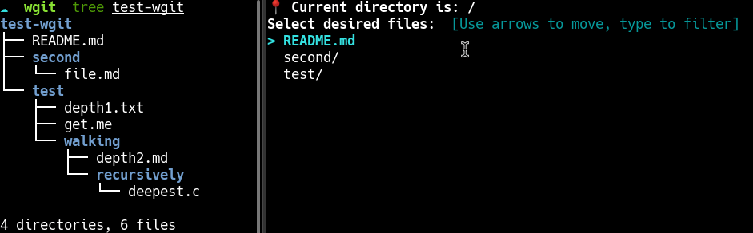
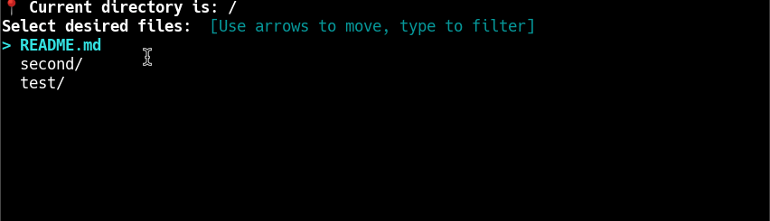
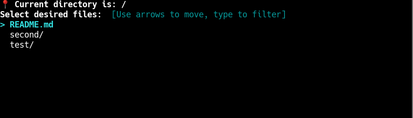

# Wgit

<div align="center">
    
</div>

Get any file from a Git server

[](http://golang.org)  [](https://lbesson.mit-license.org/)

## Introdution

Aren't you done of cloning a whole repository just to get a single file ?  
Wgit is the tool made for you.  
Be able to retrieve **any file**. from **any Git server**.

## Features

* In-memory clone
* Repository navigation
* Simple configuration
* Intuitive interface
* Multiple authentication methods
* Easy-to-use
* Cross-platform

## 🧠 In-memory clone

Wgit clones the desired repository in memory. This prevents writing to disk unnecessarily. It extends the life of your disk.

```go
Info("Cloning github.com/go-git/go-billy in memory")
storer := memory.NewStorage()
bfs := memfs.New()

r, err := git.Clone(storer, bfs, &git.CloneOptions{
    URL: "https://github.com/go-git/go-billy",
})
```

## 🚢 Repository navigation

Wgit allows you to navigate inside a Git repository directly from your terminal.

<div align="center">
    
</div>

## 📄 Simple configuration

Wgit is easily configurable on first launch. It asks you few questions and store it in a file (`$HOME/.config/wgit/config.json`). The prompt will ask you for the following things :
* Git username
* Default repository
* Prefered authentication method (SSH/HTTP/Access Token)
* Access token (with at least read rights)

Here is an exemple of configuration file:
```json
{
  "Username": "atsika",
  "Token": "XXXXXXXXXXXXX",
  "SSHkeyPath": "/home/atsika/.ssh/id_rsa",
  "Repository": "https://github.com/atsika/test-wgit",
  "AuthMethod": "Access Token"
}
```

## ⌨️ Intuitive interface

Wgit is designed with an intuitive TUI to make it usage simple. It shows messages on file selection/removal. Pressing `Ctrl + C` will pop an action menu with the following options:
* Back: go back to file selection
* List selected files: displays all selected files as a list
* Get selected files: downloads all selected files to current directory
* Exit: quit the program

<div align="center">
    
</div>

## 🔑 Multiple authentication methods

Wgit allows you to authenticate to your Git server using following methods:
* SSH (will require you to set SSH private key path)
* Access Token (will require you to set an access token)
* HTTP (uses username and prompt you for password)

## 🔰 Easy-to-use

With few clicks, Wgit allows to rapidly and easily perform some basic tasks _like grabbing some juicy code from Github_ that would take your more actions than if it were done by the tool.  
Wgit embeds a search filter so you could find your files faster.

<div align="center">
    
</div>

    💡 When setting up configuration, auto-completion is enabled for SSH private key full path.

## 🤝 Cross-platform

Since Wgit is made in Go and using full cross-platform packages, it should run on any plateform.

⚠️ Currently only tested on:
* Linux Fedora 34

Feel free to test it on other platform and submit a merge request with updated [README.md](README.md).

## 📝 TODO

* Waiting you to tell me :)

## Credits

Those amazing packages:
* [go-git](https://github.com/go-git/go-git)
* [go-billy](github.com/go-git/go-billy)
* [Survey](https://github.com/AlecAivazis/survey)

## LICENSE

MIT License (see [LICENSE](LICENSE)).

## Author

made with ❤️ by Atsika ([@_atsika](https://twitter.com/_atsika))